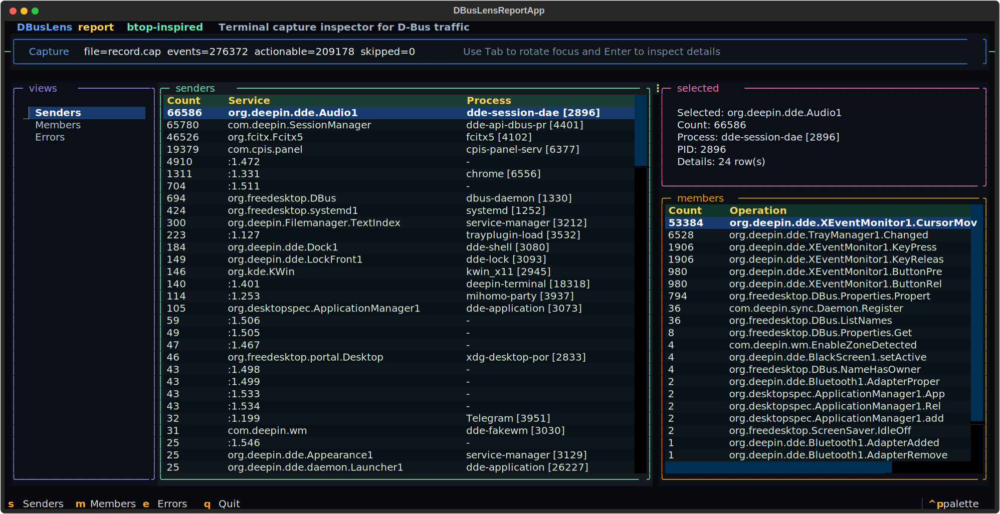
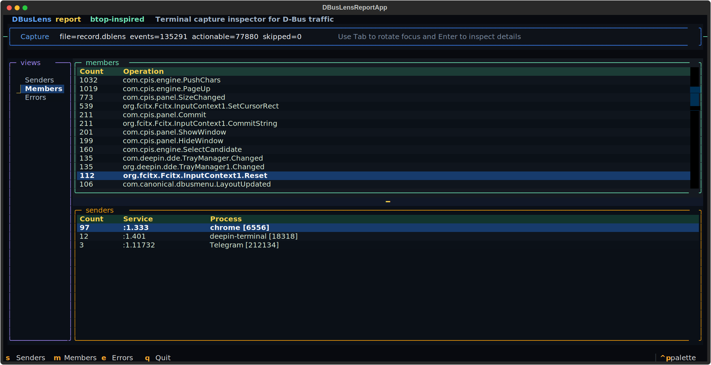
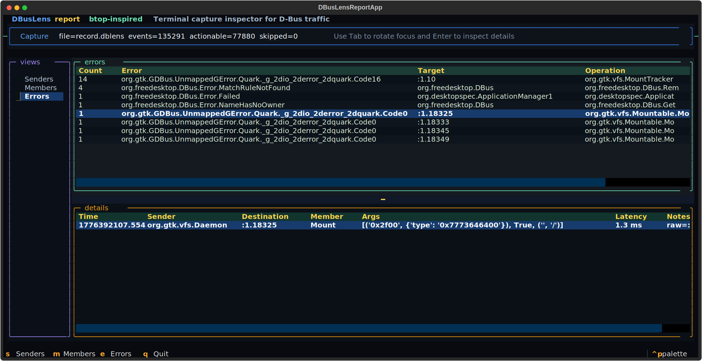

<p align="center">
  
</p>

# DBusLens

DBusLens is a terminal tool for recording and inspecting D-Bus traffic. It stores captures as `.dblens` bundles, opens them in a Textual UI, and helps you quickly understand who is sending messages, which members are busiest, and where errors are happening.

## Highlights

- Record D-Bus traffic from the `session` or `system` bus with a fixed duration.
- Open saved captures in a terminal UI built for quick inspection.
- Browse traffic by `Senders`, `Members`, and `Errors`.
- Use the detail pane to inspect row-level context and capture-time error diagnostics without leaving the terminal.
- Keep analysis workflow simple: capture first, report later.

## Screenshots

### Senders



### Members



### Errors



## Quick Start

Create the environment and install dependencies:

```bash
uv sync
```

Record a capture:

```bash
uv run dbuslens record --duration 10
uv run dbuslens record --bus system --duration 60 --output /tmp/system.dblens
```

Open a saved capture in the terminal UI:

```bash
uv run dbuslens report
uv run dbuslens report --input /tmp/system.dblens
```

Format reference:

- [`docs/dblens-format.md`](./docs/dblens-format.md)

## Operation Guide

`dbuslens` has two main commands:

- `record`: start a timed D-Bus capture and save it as a `.dblens` bundle
- `report`: open a saved `.dblens` bundle in the Textual report UI

Default behavior:

- `record` uses the `session` bus by default
- `report` reads `record.dblens` by default

Typical workflow:

1. Record traffic during the period you want to observe.
2. Open the saved `.dblens` bundle with `report`.
3. Switch between `Senders`, `Members`, and `Errors`.
4. Move through the table and inspect the detail pane for the selected row or error summary.

## Keyboard Shortcuts

- `s`: switch to `Senders`
- `m`: switch to `Members`
- `e`: switch to `Errors`
- `Left` / `Right`: switch between views
- `Up` / `Down`: move inside the focused list or table
- `Tab` / `Shift+Tab`: switch focus between panes
- `Enter`: jump to the detail pane
- `q`: quit

## License

Licensed under the GNU General Public License v3.0. See [LICENSE](./LICENSE).
